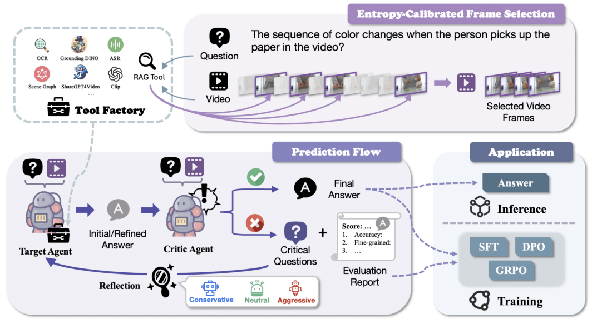

# ReAgent-V: A Reward-Driven Multi-Agent Framework for Video Understanding

[Yiyang Zhou*](https://yiyangzhou.github.io/),   [Yangfan He*](https://github.com/codepassionor),   [Yaofeng Su](https://github.com/InfiniteLoopCoder),   [Siwei Han](https://github.com/Lillianwei-h),   [Joel Jang](https://github.com/joeljang), [Gedas Bertasius](https://www.gedasbertasius.com/),   [Mohit Bansal](https://www.cs.unc.edu/~mbansal/),   [Huaxiu Yao](https://www.huaxiuyao.io/)
<div align="center">
*Equal Contribution
</div>
<div align="center">
    <a href="https://arxiv.org/abs/2506.01300"></a>
</div>

**ReAgent-V** is a **modular**, **extensible**, and **reward-aware** video reasoning framework designed to elevate video question answering and reasoning through:

- 🔧 **Flexible Tool Integration** — Plug-and-play support for OCR, ASR, object detection, scene graph generation, captioning, and more  
- 🧠 **Reward-Guided Inference** — Enables real-time self-correction via structured reward signals  
- 🎯 **Adaptive Model Alignment** — Aligns models dynamically based on inference-time feedback  
- 🗂️ **High-Quality Data Selection** — Facilitates sample-efficient learning using reflective evaluation  
- 📊 **Entropy-Calibrated Frame Selection** — Prioritizes key frames for focused reasoning  
- 🔁 **Multi-Perspective Reflection** — Refines answers through debate among conservative, neutral, and aggressive viewpoints

  
## News
* 🔥 [10.03] Our paper is online now: https://arxiv.org/abs/2506.01300.


---

# 📌 Overview
  
### ReAgent-V consists of two major components:

## 🎥 Video Understanding 

- **Entropy-Calibrated Frame Selection**  
  Efficiently selects the most informative frames for video reasoning.

- **Tool-Augmented Inference**  
  Dynamically integrates multimodal tools including OCR, ASR, object detection, scene graph generation, and captioning.

- **Multi-Agent Reflection**  
  Iteratively refines outputs by encouraging disagreement and consensus among diverse agent personas (conservative / neutral / aggressive).

- 📁 Module: `ReAgent-V`  
- 📘 Instructions: [Video Understanding README](https://github.com/aiming-lab/ReAgent-V/blob/main/ReAgent-V/README.md)

---

## 🚀 Applications

ReAgent-V supports a range of real-world tasks via dedicated application modules:

### 🧭 VLA Alignment  
Aligns **Vision-Language-Action (VLA)** models using **Trajectory-wise Preference Optimization (TPO)** guided by ReAgent-V’s reward feedback.

- 📁 Module: `Application/VLA-Alignment`  
- 📘 Instructions: [VLA Alignment README](https://github.com/aiming-lab/ReAgent-V/blob/main/Application/VLA-Alignment/README.md)

### 🔍 Video LLM Reasoning *(Coming Soon)*  
Supports reflection-based evaluation and reward-guided sample curation for long-form video LLM fine-tuning using **GRPO** strategies.

- 📁 Module: `Application/LLM-Reasoning`  

---

## 🧑‍💻 Getting Started

Each subfolder contains its own `README.md` with detailed installation, setup, and training instructions. To get started:

1. Clone the repository  
2. Follow the environment setup and requirements in each module  
3. Explore the demo scripts and customize as needed

💬 If you have questions or encounter any issues, feel free to open an [issue](https://github.com/aiming-lab/ReAgent-V/issues) or contact the maintainers.

---

## 📚 Citation

If you find ReAgent-V helpful in your research or projects, please consider citing:

```bibtex
@article{zhou2025reagent,
  title={ReAgent-V: A Reward-Driven Multi-Agent Framework for Video Understanding},
  author={Zhou, Yiyang and He, Yangfan and Su, Yaofeng and Han, Siwei and Jang, Joel and Bertasius, Gedas and Bansal, Mohit and Yao, Huaxiu},
  journal={arXiv preprint arXiv:2506.01300},
  year={2025}
}
